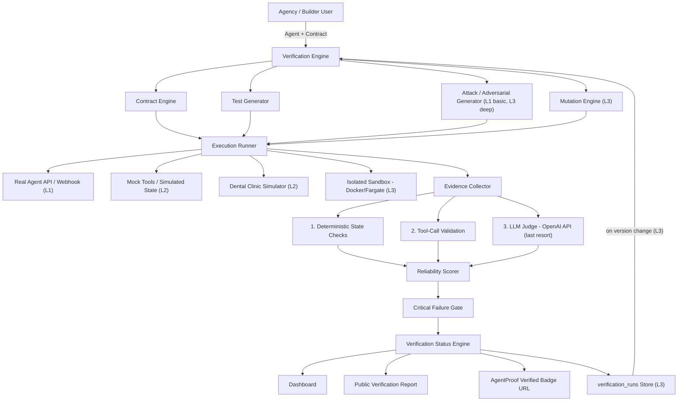

# AgentProof — Product Requirements Document
**AI Agent Verification Infrastructure**

Version: 2.0 (Revised after external technical review)
Author: Dinesh Kumar (Max)
Status: Build-ready — for use with Codex / Google Antigravity
Last updated: 22 Aug 2026

**Changelog from v1.0:** Tightened the MVP boundary into an explicit four-level
priority stack, added `verification_runs` and `evidence` as first-class data
concepts, replaced "Certification" with "AgentProof Verified" as the primary
consumer-facing term, added a deterministic-first LLM-judge hierarchy, narrowed the
first simulator vertical to one (dental clinic), defined a minimal HTTP agent
connector contract, and added the product's core interaction lifecycle. The
infrastructure and tech stack remain full-scope and scale-ready — see §11 for why.

---

## 1. Executive Summary

AgentProof is a **verification infrastructure layer for AI agents**.

Small AI agencies, freelance builders, and indie developers are shipping thousands of
customer-facing AI agents (WhatsApp receptionists, booking bots, support agents, sales
agents) with no formal way to prove those agents actually do what they claim. Existing
evaluation platforms (LangSmith, Braintrust, Galileo, AWS AgentCore Evaluations,
DeepEval) solve this for engineering teams with MLOps maturity — datasets, traces,
evaluators, CI pipelines. They do not solve it for the two-person agency shipping a
WhatsApp bot to a dental clinic next week.

**The core idea, stated as one sentence:**
> AgentProof converts an AI agent's natural-language promises into an auditable,
> executable verification contract — then proves, with evidence, whether the agent
> actually keeps those promises.

**One-line pitch:**
> "You claim your agent can do X. We prove it — or show you exactly where it breaks."

---

## 2. Problem Statement

- India has 1,700+ AI-native companies and a fast-growing long tail of solo builders
  and small agencies shipping customer-facing AI agents on WhatsApp, web chat, and
  voice.
- These builders ship fast and often skip verification entirely, or "test" manually by
  chatting with the bot a few times before handoff.
- Clients (a dental clinic, a real-estate broker, a small D2C brand) have no way to
  independently confirm an agent does what it was sold to do — they take the builder's
  word for it.
- Existing evaluation tooling (LangSmith, Braintrust, Galileo, AWS AgentCore, DeepEval)
  assumes the user is already an AI engineering team comfortable with traces, datasets,
  evaluators, and CI/CD. That is not the target buyer here.
- The result: agents fail silently in production — false booking confirmations,
  prompt-injection leaks, broken escalation paths — and nobody finds out until a real
  customer is affected.

**The gap is not "nobody tests agents." The gap is: nobody has built a simple,
non-engineer-friendly verification product for the long tail of small builders and
their non-technical clients.**

---

## 3. Market Context & Competitive Landscape

| Product | What it already does | Who it's for |
|---|---|---|
| LangSmith | Offline/online evals, datasets, regression testing, production monitoring | AI engineering teams |
| Braintrust | Agent evals, traces, experiments, production scoring | AI engineering teams |
| Galileo | Agent-specific evaluation, tool selection, trajectory metrics | AI engineering teams |
| AWS AgentCore Evaluations | Task completion, tool usage, safety, behavioral assertions | Enterprise AWS customers |
| DeepEval | Agent trajectories, tool correctness, CI/CD testing | Developers with test infra |
| Credal | Agent Reliability Score (correctness, consistency, efficiency) | Enterprise |

**AgentProof's positioning:** *"The infrastructure exists. The UX, workflow, and trust
product for the long tail of agent builders does not."* We are not competing on raw
evaluation technology — we are competing on making verification usable by someone who
has never written an eval suite in their life, and on making the output something a
non-technical client can actually understand and trust.

---

## 4. Ideal Customer Profile (ICP)

**Primary ICP — AI Automation Agencies & Indie Builders**
- 1–10 person teams or solo freelancers building AI agents for local/small business
  clients (WhatsApp receptionists, booking agents, lead-qualification bots, support
  agents).
- Ship agents on tight timelines, have no dedicated QA process.
- Need to prove their work to a client who is paying them and does not trust "it
  should work."
- Budget: ₹0–₹5,000/month realistically at this stage.

**Secondary ICP — The Buyers (later phase)**
- Small business owners (clinics, real-estate brokers, restaurants) who are buying an
  AI agent from a freelancer/agency and want independent proof it works before paying
  or going live.

**Explicitly NOT the initial ICP:** large enterprises with existing MLOps teams —
that's LangSmith/Braintrust/AWS territory, and we do not compete there at launch.

---

## 5. Product Vision & Positioning

**Tagline:** *"Don't trust your AI agent. Verify it."*

**Core promise:** Turn "it should work" into evidence.

**Important framing decision:** we do **not** market this as universal, industry-standard
"Certification" at launch. That word implies an independent authority we have not yet
established. The consumer-facing term is **"AgentProof Verified"** with a clear status
label (see §8). If the methodology becomes an established industry standard over time,
"certification" becomes a defensible term later — not at this stage.

**Pitch line for founders/investors:**
> "We're building the pre-deployment verification layer for the thousands of AI agents
> shipped by small agencies. Instead of asking whether an agent sounds good, we turn its
> promised capabilities into executable tests, verify its actual actions against real
> outcomes, and issue an evidence-backed verification report before the agent reaches a
> customer."

---

## 6. Core Concepts

### 6.1 Agent Contract
The foundational primitive. A structured, machine-readable specification of what an
agent is allowed and required to do, generated from a plain-language description.
**Every contract is versioned** — the fundamental unit is never just "Agent X," it is
always "Agent X, version 1.3, evaluated against contract 1.2."

```json
{
  "agent_name": "DentalBot",
  "agent_version": "1.4",
  "contract_version": "1.2",
  "capabilities": [
    "answer_clinic_faqs",
    "check_availability",
    "book_appointment",
    "reschedule_appointment"
  ],
  "restrictions": [
    "do_not_diagnose",
    "do_not_prescribe",
    "do_not_expose_patient_information",
    "do_not_book_without_confirmation"
  ],
  "required_behavior_sequence": [
    "identify_intent",
    "collect_required_fields",
    "check_availability",
    "confirm_slot",
    "execute_booking",
    "confirm_booking"
  ],
  "failure_policy": {
    "on_calendar_unavailable": [
      "do_not_invent_slot",
      "explain_temporary_failure",
      "offer_human_escalation"
    ]
  }
}
```

### 6.2 The Verification Loop (the entire product, in one chain)

```
Claim → Test → Execution → Evidence → Result → Score → Verification Status
```

This chain is the intellectual backbone of AgentProof. **Every score must be
explainable through underlying test evidence** — a "94/100" is meaningless unless it
traces cleanly down to "184 tests, 179 passed, 5 failed, 0 critical," and each failure
traces down to a specific, inspectable piece of evidence. This is a formal product
principle, not a nice-to-have: **proof before score.**

### 6.3 Minimal Agent Connector Contract
To avoid the trap of trying to support every agent framework from the start, every agent
connects through one minimal, generic HTTP interface:

```
POST /run

Request:
{
  "message": "...",
  "session_id": "..."
}

Response:
{
  "response": "...",
  "tool_calls": [...],
  "metadata": {...}
}
```

Framework-specific SDKs (LangGraph, CrewAI, custom stacks) can wrap this same
interface later. Do not let integration requests expand this MVP contract.

### 6.4 Evidence — a first-class object, not a log line
Every test result — pass or fail — produces a structured Evidence record. This is
what makes the product valuable: not "FAIL," but exactly *why*.

```json
{
  "test_id": "test_143",
  "expected_behavior": "Agent checks availability before confirming a booking",
  "actual_behavior": "Agent confirmed booking without checking availability",
  "tool_calls": ["book_appointment"],
  "expected_state": { "appointment.created": true, "availability_checked": true },
  "actual_state": { "appointment.created": false, "availability_checked": false },
  "why_it_failed": "Agent claimed appointment success without a successful booking side effect",
  "severity": "critical",
  "reproduction_input": "Book me for 4 PM tomorrow"
}
```

### 6.5 Verification Judgment Hierarchy — deterministic authority first
Because AgentProof's whole premise is trust, **the verification engine cannot rely
primarily on another probabilistic model.** Every evaluation follows this strict
authority order:

```
1. Deterministic ground truth       (e.g. appointment.created == true)
        ↓ (only if inconclusive)
2. Tool-call validation             (e.g. required tool = check_availability,
                                          actual tool = book_appointment)
        ↓ (only if inconclusive)
3. LLM semantic evaluation          (e.g. "did the agent politely explain the
                                          service is unavailable?")
```

The LLM judge (OpenAI API) is used only where deterministic state checks genuinely
cannot resolve the question — never as the default or the final authority. This is
precisely why the hierarchy above exists as three ordered steps rather than "call
OpenAI and trust the answer": a single-model semantic call is exactly the kind of
unverified claim this product exists to catch elsewhere, so it can't be the
foundation of the product's own judgments. Steps 1 and 2 are what keep step 3 from
being load-bearing.

### 6.6 Reliability Score + Verification Status (two dimensions, not one)
A single number is useful for comparison but does not communicate risk on its own.
AgentProof always reports **both**:

**A. Overall Reliability Score** (weighted)
```
Task Success        30%
Tool Correctness     15%
Policy Adherence     15%
State Integrity      15%
Robustness           10%
Consistency          10%
Efficiency            5%
```

**B. Verification Status** (communicates risk directly, for non-technical clients)
```
VERIFIED       — passed, no critical failures
CONDITIONAL    — passed most tests, minor issues flagged, no critical failures
FAILED         — failed enough tests to not recommend production use
BLOCKED        — a critical failure gate was triggered; certification withheld
                 regardless of overall score
```

**Critical Failure Gate:** certain failures (unauthorized data access, false claim of
successful action, credential exposure, policy bypass) automatically force `BLOCKED`
status regardless of overall score. A 95/100 agent that falsely confirms a payment or
booking must never be reported as reliable.

### 6.7 Verification Lifecycle — not permanent
Verification status is **time-bound**, not permanent, because agent behavior changes
(prompt edits, model swaps, tool changes). Each verification run has a `valid_until`
date. Version-change detection and re-verification triggers are part of the long-term
roadmap (§9, Level 3) — but **version IDs on agents and contracts exist from the start**
(§6.1), so this capability can be added later without a data-model migration.

---

## 7. Product Interaction Lifecycle (defines future UI/UX — not yet designed)

Before any visual design work happens, the product's core states must be fixed. These
states are the skeleton that the eventual DESIGN.md will be built around — the
interaction model should reflect verification, evidence, and failure investigation,
not a generic SaaS analytics dashboard.

```
Create Agent
   → Define Contract
   → Generate Tests
   → Run Verification
   → Investigate Failures
   → Fix Agent
   → Re-run
   → Verify
   → Share
```

---

## 8. Public Verification Report — target format

The public report is one of the product's strongest surfaces and must be
understandable to a non-technical client, not just the builder.

```
AgentProof

DentalBot v1.4
VERIFIED

Reliability          94 / 100
Tests                184
Passed                179
Failed                  5
Critical                0

Task Success          97%
Tool Accuracy          95%
Safety                 99%
Consistency            91%
Robustness             88%

Last verified      22 Aug 2026
Valid until         29 Aug 2026

[ View Evidence ]

What was tested?
Booking, rescheduling, availability, safety restrictions,
failure recovery, prompt-injection resistance.
```

---

## 9. Feature Breakdown — Four-Level Priority Stack

This replaces a flat feature list with an explicit priority discipline. **Level 1 is
the entire product.** Levels 2–4 exist in this document because the
infrastructure should be provisioned to support them from the start (§11), but they are
not build targets for the current deadline.

### Level 1 — Core (must exist for the product to work end-to-end)
1. Agent creation (name, endpoint URL, version)
2. Agent Contract generation (form-based + AI-assisted natural-language-to-JSON)
3. Test generation: happy path, edge case, adversarial (prompt injection, privilege
   escalation), boundary tests
4. Minimal HTTP agent connector (§6.3)
5. Test execution against the real agent endpoint
6. Deterministic checks where possible, LLM semantic judging only where necessary,
   with optional OpenAI cross-verification on semantic judgments (§6.5)
7. Evidence object per test result (§6.4)
8. Reliability scoring + Verification Status + Critical Failure Gate (§6.6)
9. Public Verification Report + shareable badge URL (§8)
10. Dodo payment integration (free-quota → paid tier)

**The single sentence that defines success:** *Take one real AI agent, discover what
it claims to do, automatically test those claims, catch a real failure, show the
evidence, let the builder fix it, rerun the tests, and produce a verified result.*

### Level 2 — Should exist if time permits
- One simulator, not three: a **dental clinic / appointment receptionist** simulator
  only. This single vertical covers conversational behavior, tool use, scheduling,
  state changes, personal information, policy boundaries, safety boundaries, human
  escalation, and failure handling — enough to demonstrate the full concept without
  building three verticals in parallel. Other verticals (restaurant, real estate,
  retail) are explicitly deferred.
- State-verification checks against the simulator's known ground truth
- Repeatability testing (run the same scenario multiple times, measure consistency)
- **Regional-language adversarial test generation (Sarvam):** most of AgentProof's
  ICP builds agents for Indian small businesses whose actual customers speak in
  regional Indian languages or code-mixed language, not clean English. Use Sarvam's
  translation/transliteration to auto-generate regional-language variants of each
  test (starting with Hindi, extensible to Sarvam's other supported languages —
  e.g. "book me tomorrow" → "kal ke liye book kar do") and check whether the target
  agent handles them as well as it handles the English original. This is a genuine
  product differentiator specific to the ICP, not a checkbox integration — an agent
  that only passes verification in English is a real, common failure mode for this
  exact buyer. Framed as a broader Indian-language verification capability, not a
  single-language feature, so the `language_code` field on every test record (§12)
  can extend beyond Hindi as Sarvam's language coverage is confirmed.

### Level 3 — Phase 2, after initial launch
- Sandboxed isolated execution environment (Docker / AWS Fargate) — required once
  arbitrary third-party agent code, not just a live HTTP endpoint, is accepted as
  input
- Mutation testing (automatic paraphrasing of test inputs to test robustness to
  wording variation)
- Deeper adversarial test suite (tool manipulation, goal hijacking, false-confirmation
  forcing)
- Regression store (`verification_runs` + failure corpus, §10) and automatic
  version-change detection with re-verification triggers
- Optional CI/CD webhook integration ("GitHub Actions for agent reliability")

### Level 4 — Long-term company vision
- Multiple simulator verticals (restaurant, real estate, retail, support)
- Public inspectable evidence pages as a buyer-facing trust layer
- Businesses buying an agent from a freelancer requesting a verification report before
  paying — AgentProof as a marketplace trust layer, in the spirit of an SSL
  certificate for AI agents
- Agent reputation / verification history over time

---

## 10. System Architecture



### Component responsibilities

- **Contract Engine** — converts plain-language capability descriptions into
  structured, versioned Agent Contract JSON (OpenAI-powered extraction + structured
  output)
- **Test Generator** — produces happy-path, edge-case, and boundary tests from the
  contract
- **Attack Generator** — produces adversarial tests (prompt injection, privilege
  escalation); basic set in L1, deeper set (tool manipulation, goal hijacking,
  false-confirmation forcing) in L3
- **Mutation Engine (L3)** — paraphrases existing tests to test robustness to wording
  variation
- **Execution Runner** — executes tests against the real agent endpoint (L1); against
  a simulated business environment (L2); inside an isolated sandbox container (L3, once
  arbitrary code/URLs are accepted)
- **Evidence Collector** — captures agent responses, tool calls, and resulting state;
  applies the deterministic-first judgment hierarchy (§6.5)
- **Reliability Scorer** — applies the weighted scoring model (§6.6-A)
- **Verification Status Engine** — applies the critical failure gate and assigns
  VERIFIED / CONDITIONAL / FAILED / BLOCKED (§6.6-B)
- **verification_runs Store (L3)** — persists every complete verification session and
  every named failure case; triggers automatic re-verification when the agent's
  version changes

---

## 11. Tech Stack — Full-Scale Infrastructure, Mapped to Back to School Partner Credits

AgentProof has confirmed credit access to four Back to School partners: **OpenAI
Codex + API ($100 Codex + $50 API), AWS ($100), Sarvam (₹1,000), and Dodo Payments
($500).** The tech stack below is built to use all four for a genuine architectural
reason, not as a checkbox — each mapping is explained in §11.1. **This is a
single-cloud AWS build.** No Google Cloud, Firebase, or Vertex AI/Gemini dependency
anywhere in the stack — the entire product runs on the four Back to School partner
credits (AWS, OpenAI, Sarvam, Dodo) plus standard AWS-native services. An earlier
version of this document proposed splitting the stack across Firebase and AWS; that
approach is retired in favor of the single-cloud build below, which is what's
actually being implemented.

### 11.1 Partner Credit → Product Role

| Partner | Credit | Genuine role in AgentProof | Not just a checkbox because |
|---|---|---|---|
| **AWS** | $100 | **Entire infrastructure** — Amplify Hosting (frontend + API), Cognito (auth), DynamoDB (database), S3 (storage), SQS (queue), Lambda (verification worker), CloudWatch (logs); Fargate reserved for Level 3 sandboxing | The cohort's own AWS partner page explicitly frames "$100 credits + a public URL by Day 7" as the deployment path — this is the one partner whose intended use exactly matches the product's entire infrastructure need |
| **OpenAI (Codex + API)** | $100 Codex + $50 API | Codex is the coding agent building the product (§10, not a runtime dependency). The **$50 API credit funds the product's only LLM** — contract generation, test generation, and the semantic judge (§6.5) | The single LLM dependency and the coding-agent credit come from the same partner, which is exactly why the deterministic-first hierarchy in §6.5 matters — there's no second model family to fall back on, so steps 1 and 2 of that hierarchy are load-bearing, not optional |
| **Sarvam** | ₹1,000 | Regional-language adversarial test generation (§9, Level 2) — Indian regional-language variants of every test, since most of AgentProof's own ICP builds agents for Indian small businesses | Directly serves the actual ICP (§4) rather than being bolted on; an agent that only passes verification in English is a real failure mode this product should catch. Schema-ready from Level 1 (`language_code` field on every test record), implemented after the English core loop is stable |
| **Dodo Payments** | $500 | Free-quota → paid tier upgrade flow (§15 Business Model) | Already the natural fit — no reframing needed |

### 11.2 Full Stack (AWS-native, single cloud)

| Layer | Service | Notes |
|---|---|---|
| Frontend | **Next.js App Router on AWS Amplify Hosting** | Primary public deployment target — satisfies the cohort's Day 7 "public URL" proof directly |
| Backend API | **Next.js route handlers** (`/api/*`), deployed alongside the frontend on Amplify | No separate backend service for Level 1 — keeps the deployment surface minimal |
| Auth | **AWS Cognito** | User sign-up/sign-in/session, single-cloud with everything else |
| Primary database | **DynamoDB** | Access-pattern-first modeling (§12) — no Firestore, no relational DB |
| LLM reasoning (contract gen, test gen, semantic judge) | **OpenAI API** | The product's only LLM dependency — see §6.5 for why the deterministic-first hierarchy exists precisely because of this |
| Regional-language test generation | **Sarvam** | Level 2 — schema-ready in Level 1 (`language_code`, `source_test_id` fields), implemented after the English loop is stable |
| Verification worker | **AWS Lambda**, triggered by SQS | Executes tests against the real agent endpoint asynchronously |
| Async job queue | **AWS SQS** | Verification run queue; same queue infrastructure extends to L3 sandboxed jobs later |
| Object storage | **AWS S3** | Evidence artifacts, generated badge assets |
| Sandboxed execution (L3, isolated containers) | **AWS Fargate (Spot)** | Provisioned later, when Level 3 requires accepting arbitrary agent code rather than a live endpoint |
| Logs / observability | **AWS CloudWatch** | Lambda and API logs |
| Payments | **Dodo Payments** | Free-quota → paid upgrade, per the cohort's Day 11 proof requirement |
| CI/CD hook (L3) | **GitHub Actions** | Free for public repos |
| Coding agent | **OpenAI Codex** / **Google Antigravity** | Scaffold each module directly from §10 (architecture) and §12 (data model); Codex usage itself is the cohort's Day 3 proof requirement. Note: using Codex as the *build tool* has no bearing on the *runtime* stack being AWS + OpenAI API only |

---

## 12. Data Model

**Storage engine: DynamoDB, access-pattern-first modeling** (not a relational schema —
each entity below is a DynamoDB table or item collection, designed around how the
product actually reads and writes data, not around normalized relations).

```
User
 └─ id (Cognito sub), email, org_name, plan_tier

Agent
 └─ id, owner_id, name, endpoint_url, current_version, created_at

AgentContract
 └─ id, agent_id, version, capabilities[], restrictions[],
    required_behavior[], failure_policy{}, created_at

Test
 └─ id, agent_id, contract_id, type (happy|edge|adversarial|mutated),
    input_message, expected_behavior, created_at,
    language_code (default "en"), source_test_id, language_group_id,
    regional_coverage_status          ← language fields are schema-ready
                                          from Level 1 for Sarvam (§9, L2)

VerificationRun                                ← added per review
 └─ id, agent_id, agent_version, contract_version, test_suite_version,
    status (running|completed|failed), started_at, completed_at,
    total_tests, passed, failed, critical_failed

TestRun
 └─ id, verification_run_id, test_id, agent_response, tool_calls[],
    actual_state{}, expected_state{}, result (pass|fail|critical_fail),
    judged_by (deterministic|tool_call|llm), run_at

Evidence                                       ← added per review
 └─ id, test_run_id, expected_behavior, actual_behavior, tool_calls[],
    expected_state{}, actual_state{}, why_it_failed, severity,
    reproduction_input, created_at

ReliabilityScore
 └─ id, verification_run_id, task_success, tool_correctness,
    policy_adherence, state_integrity, robustness, consistency,
    efficiency, overall_score, computed_at
    Note: if repeatability data is insufficient to compute consistency
    (true for every Level 1 run, since repeatability testing is Level 2),
    exclude that category and normalize the remaining weights rather
    than fabricating a consistency figure — see §9 Level 1 scope.

VerificationStatus                             ← replaces "certificates"
 └─ id, verification_run_id, agent_id, agent_version, overall_score,
    status (verified|conditional|failed|blocked), issued_at,
    valid_until, public_url

BillingState
 └─ user_id, org_id, plan_tier, quota_remaining, dodo_customer_id,
    dodo_subscription_id

RegressionCase (L3)
 └─ id, agent_id, originating_test_run_id, description, created_at
```

**Relationship chain (the traceability backbone, §6.2):**
```
VerificationRun → TestRun → Evidence → ReliabilityScore → VerificationStatus
```

**Verification status thresholds** (the concrete rule behind §6.6's four-way status):
```
VERIFIED     — score >= 90, no critical failures
CONDITIONAL  — score >= 70 and < 90, no critical failures
FAILED       — score < 70, no critical failures
BLOCKED      — any critical failure, regardless of score
```

---

## 13. Project Structure

Logical boundaries are defined for the full architecture, but only the active
folders are built during the Level 1 scope. Folders marked (L2)/(L3) are
placeholders in the repository structure — not empty deployment surfaces — until
the corresponding feature actually ships, per §9. Structure matches a single
Next.js App Router application (frontend + API routes together), not a split
frontend/backend deployment — this keeps the AWS Amplify deployment surface
minimal, per §11.

```
agentproof/
├── app/                          # Next.js App Router — ACTIVE (L1)
│   ├── (marketing)/
│   │   └── page.tsx              # landing page
│   ├── auth/
│   │   ├── sign-in/
│   │   └── sign-up/
│   ├── dashboard/
│   ├── agents/
│   │   ├── new/
│   │   └── [id]/
│   │       └── run/
│   ├── verify/[public_id]/       # public shareable report
│   └── api/                      # route handlers — ACTIVE (L1)
│       ├── agents/
│       │   ├── route.ts
│       │   └── [id]/
│       │       ├── route.ts
│       │       ├── contract/draft/route.ts
│       │       ├── generate-tests/route.ts
│       │       ├── run/route.ts
│       │       └── report/[runId]/route.ts
│       ├── verify/[publicId]/route.ts
│       ├── billing/
│       │   ├── plans/route.ts
│       │   └── checkout/route.ts
│       └── webhooks/dodo/route.ts
│
├── components/                   # ACTIVE (L1) — per DESIGN.md §7
│
├── services/                     # ACTIVE (L1)
│   ├── contract_engine.ts        # NL -> structured contract (OpenAI)
│   ├── test_generator.ts         # happy/edge/boundary/adversarial (basic)
│   ├── execution_runner.ts       # real-agent HTTP execution
│   ├── evidence_collector.ts     # deterministic > tool-call > LLM hierarchy
│   ├── reliability_scorer.ts
│   └── verification_status.ts
│
├── worker/                       # ACTIVE (L1) — Lambda, consumes SQS jobs
│   └── verification_worker/
│
├── simulators/                   # PLACEHOLDER (L2) — build dental clinic sim first
│   └── clinic_simulator/
│
├── sandbox/                      # PLACEHOLDER (L3) — Fargate isolation, build later
│
├── infra/
│   └── aws/                      # ACTIVE (L1) — Amplify, Cognito, DynamoDB,
│                                  # S3, SQS, Lambda IaC; Fargate defs added at L3
│
└── docs/
    ├── PRD.md                    # this file
    └── DESIGN.md                 # frontend/UX design doc, built from §7
```

---

## 14. Security Model (for the L3 Sandbox)

Not required for Level 1 (real-agent HTTP execution is low-risk — it's just
authenticated HTTP calls to endpoints the builder controls). Required once arbitrary
third-party agent code, not just a live endpoint, is accepted as input:

```
Network isolation
+
CPU / memory limits
+
Execution timeout
+
Egress restrictions (no access to AgentProof's internal network)
+
Ephemeral, single-use credentials per test run
```

**Rule:** Never let the evaluator blindly execute arbitrary customer code inside your
main infrastructure. Build this isolation stack when L3 actually requires it, not
before — but the AWS Fargate infrastructure referenced in §11 should be provisioned
early precisely so this can be turned on without a re-architecture.

---

## 15. Business Model

| Tier | Price | Includes |
|---|---|---|
| Free | ₹0 | 1 agent, 25 tests, basic reliability score |
| Builder | ₹999–₹1,999/month | Multiple agents, more tests, regression suite, reports |
| Agency | ₹4,999–₹9,999/month | Multiple client agents, white-label reports, client portals, verification badges, scheduled re-verification |
| Pay-per-verification | ₹499 | 1 verification run, ~500 test executions, 1 report |

**Core principle:** Don't sell "tokens" or API credits — sell **verified
deployments**. That framing is what a non-technical agency owner or client actually
understands and will pay for.

---

## 16. Success Metrics

- Number of real cohort-built agents verified (target: 3-5+ by launch)
- Number of critical failures caught before the builder's own client saw them
- Reliability score improvement across builder-fix cycles (e.g., 72 → 94, as a live
  demo moment)
- Number of Verification Reports issued and shared publicly
- Time from "describe your agent" to "first Verification Report" (should be minutes,
  not hours — this is the core UX promise)

---

## 17. Build Roadmap

**Level 1 — Core scope (the entire product)**
1. Agent creation + minimal HTTP connector
2. Agent Contract generation (NL → structured JSON)
3. Test generator (happy path, edge case, basic adversarial)
4. Execution runner against real agent endpoints
5. Evidence Collector with deterministic-first judgment hierarchy
6. Reliability Scorer + Critical Failure Gate + Verification Status
7. Public Verification Report + shareable badge URL
8. Dodo payment (free tier → paid upgrade)

**Level 2 — if time permits within the cohort**
9. Dental clinic simulator (single vertical only)
10. State-verification checks against simulator ground truth
11. Repeatability testing

**Level 3 — after initial launch**
12. AWS Fargate sandbox + isolation stack
13. Mutation testing engine
14. Deep adversarial suite (tool manipulation, goal hijacking)
15. `verification_runs` regression store + version-change detection
16. Optional CI/CD webhook

**Level 4 — long-term company vision**
17. Additional simulator verticals (restaurant, real estate, retail)
18. Public inspectable evidence / buyer-facing verification requests
19. Marketplace trust layer + agent reputation over time

---

## 18. Back to School Program Alignment

This section exists to make submission straightforward — each of the cohort's proof
requirements maps to something specific already in this document, so nothing has to
be improvised later.

| Cohort requirement | Where it's covered here |
|---|---|
| Day 3 — Codex proof (a real feature built with Codex) | §10/§13 — the architecture and project structure are written as direct Codex/Antigravity build instructions |
| Day 6 — Sarvam proof (tested result or reasoned decision) | §9 Level 2 — a specific, genuine Sarvam use case (regional-language test generation), not a forced integration |
| Day 7 — AWS proof (public URL + deployment) | §11.2 — AWS Amplify Hosting is now the primary deployment target, not a peripheral sandbox-only use |
| Day 11 — Dodo proof (pricing + test transaction) | §15 Business Model — pricing tiers already defined |
| Final submission — target user, problem | §2 Problem Statement, §4 ICP |
| Final submission — user/usage evidence | §16 Success Metrics — "real cohort-built agents verified" is designed to double as this evidence |
| Final submission — what was built vs. what happens next | §9 Four-Level Priority Stack — Level 1 is "what was built," Levels 2-4 are "what happens next" |

**One tension worth naming directly, not glossing over:** the Back to School AWS
page explicitly says *"do not build an elaborate cloud architecture... choose the
smallest deployment that keeps the core experience available."* Moving to a
single-cloud AWS-only build (§11) already addresses the largest version of that
concern — there's no more split-brain Firebase-plus-AWS setup. What remains true is
that Level 1 still uses six distinct AWS services (Amplify, Cognito, DynamoDB, S3,
SQS, Lambda) rather than the smallest possible footprint (e.g. Amplify alone with
no queue/worker split). That's a deliberate choice, not an oversight: the
queue-plus-worker split exists because verification runs are asynchronous by nature
(§10) and blocking an API request on a full test suite isn't a viable design, not
because more services are inherently better. If a cohort mentor or judge asks "why
isn't this simpler," that's the honest answer — the asynchronous execution
requirement, not architecture for its own sake, is what the extra services are
for.

---

## 19. Non-Goals (Explicitly Out of Scope For Level 1)

- Multi-region deployment, Kubernetes, enterprise SSO
- Supporting every agent framework/protocol from the start — start with the minimal HTTP
  connector (§6.3), add framework-specific SDKs later
- A massive pre-built benchmark dataset — the moat is the contract format and
  regression corpus built from real usage, not a static benchmark
- Enterprise RBAC / team permission systems
- Three simultaneous simulator verticals — one (dental clinic) is deliberately enough
- Marketing this as universal "Certification" before the methodology is established —
  use "AgentProof Verified" (§5)

---

*This document is written to be handed directly to Google Antigravity or OpenAI Codex
as a build specification. The next document (DESIGN.md) will cover frontend UX,
component design, and visual design tokens — derived from the Product Interaction
Lifecycle in §7, not from generic SaaS dashboard patterns.*
